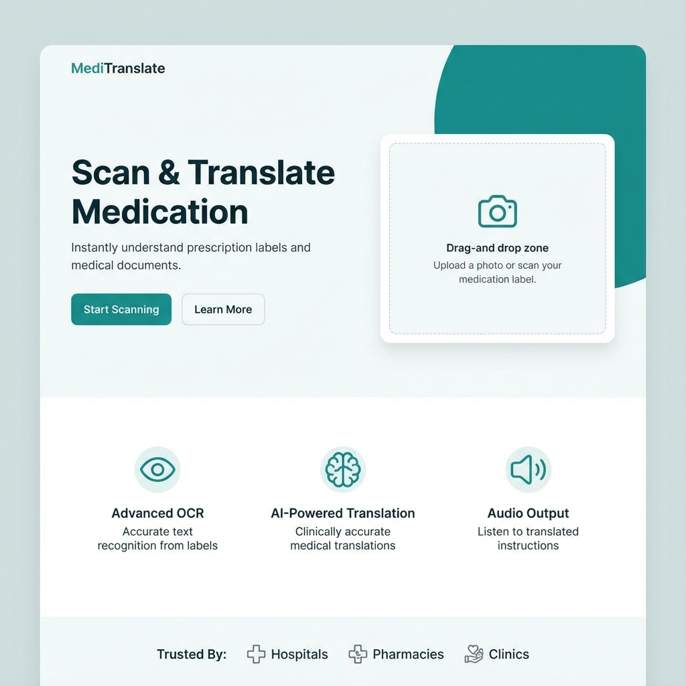
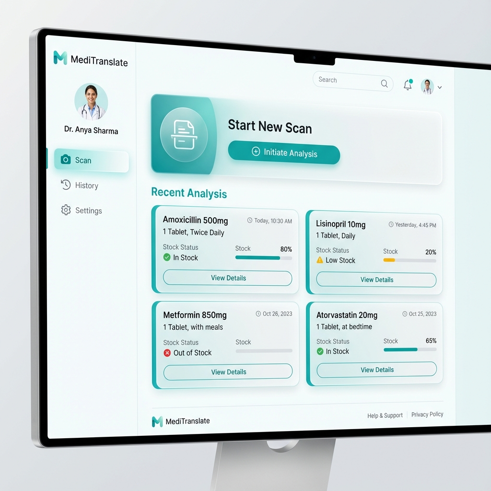

# MediTranslate – Vernacular Healthcare Companion

**MediTranslate** is an AI-powered web application designed to bridge the gap between complex medical prescriptions and patient understanding. It digitizes, translates, and explains medical prescriptions in simple regional languages, ensuring patients understand their medication regimen clearly and accurately.



---

## 🚀 Key Features

*   **AI-Powered OCR**: Uses **Google Vision API** and **Gemini Flash** to intelligently extract text from handwritten and printed prescriptions.
*   **Instant Translation**: Translates complex medical jargon into 40+ languages including Hindi, Telugu, Tamil, Spanish, and French.
*   **Medicine Insights**: accurate identification of medicines with dosage, frequency, and usage instructions.
*   **Audio Guide**: Text-to-Speech support to read out instructions for better accessibility.
*   **History & Tracking**: Save your scans and revisit past prescriptions anytime.
*   **Secure & Private**: Built with privacy-first architecture using Supabase RLS.

---

## 📸 Screenshots

### Public Landing Page
The intuitive landing page allows users to quickly scan documents and understand the platform's value.


### User Dashboard
A comprehensive dashboard for managing scan history, viewing detailed analysis, and tracking medication.


---

## 🛠️ Tech Stack

### Frontend
*   **Framework**: [Next.js 14](https://nextjs.org/) (React, TypeScript)
*   **Styling**: Tailwind CSS, Lucide Icons
*   **Animations**: Custom CSS animations, Skeleton loaders
*   **Auth**: Supabase Auth

### Backend
*   **Server**: [FastAPI](https://fastapi.tiangolo.com/) (Python 3.9+)
*   **AI/OCR**: Google Gemini Flash 1.5, Google Vision API, OpenCV
*   **Database**: Supabase (PostgreSQL)

---

## ✅ Prerequisites

Ensure you have the following installed:
*   **Python** (v3.9 or higher)
*   **Node.js** (v18 or higher)
*   **Git**

---

## 📦 Installation Guide

### 1. Clone the Repository
```bash
git clone https://github.com/VennelaDablikar/MediTranslate_Project.git
cd MediTranslate_Project
```

### 2. Backend Setup
Navigate to the backend directory and install Python dependencies:
```bash
cd backend
# Create a virtual environment (optional but recommended)
python -m venv venv
source venv/bin/activate  # On Windows use `venv\Scripts\activate`

# Install dependencies
pip install -r requirements.txt
```

### 3. Frontend Setup
Navigate to the frontend directory and install Node.js dependencies:
```bash
cd ../frontend
npm install
```

### 4. Configuration (.env)
Create a `.env` file in the **root** folder (`MediTranslate_Project/.env`) and add your API keys:
```ini
# Google Cloud (Required for best OCR results & Gemini)
GOOGLE_APPLICATION_CREDENTIALS="path/to/your/service-account-key.json"
GOOGLE_API_KEY="your-gemini-api-key"

# Database (Supabase)
SUPABASE_URL="your-supabase-url"
SUPABASE_KEY="your-supabase-anon-key"
```

---

## ▶️ How to Run

### Option A: The Easy Way (One-Click)
We have included a startup script that launches both the backend and frontend simultaneously.

From the **root** directory:
```bash
chmod +x start.sh  # Only needed the first time
./start.sh
```
This will start:
*   Backend at `http://localhost:8000`
*   Frontend at `http://localhost:3000`

### Option B: Manual Start

**Terminal 1 (Backend):**
```bash
cd backend
source venv/bin/activate
uvicorn app.main:app --reload --port 8000
```

**Terminal 2 (Frontend):**
```bash
cd frontend
npm run dev
```

Open [http://localhost:3000](http://localhost:3000) in your browser to start using MediTranslate.
